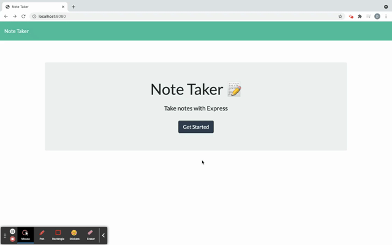

# Note Taking Application Using Express.js

## Deployed Link:
- [Heroku Deployment Link](https://vast-castle-82314.herokuapp.com/) 

## Description
- As a developer, my task was to modify starter code to create an application called Note Taker that can be used to write and save notes. This application uses an Express.js back end and will save and retrieve note data from a JSON file.
- The application’s front end had already been created. My job was to build the back end, connect the two, and then deploy the entire application to Heroku.
- A DELETE route was added to the application using `DELETE /api/notes/:id` that will receive a query parameter containing the id of the note to delete. The route will read all notes from the `db.json` file, remove the note with the given `id` property, and then rewrite the notes to the `db.json` file. This displays an empty column on the left, free of saved notes. 
- Two HTML routes were created that will GET and return the data from both `.html` files. An API route was created to read the `db.json` file and return all saved notes as JSON.
- An API to POST the notes was created to receive a new note to save on the request body, add it to the `db.json` file, and then return the new note to the client (machine). This is where the `uuid npm package` was utilized, creating a unique id for each new note saved.
- This Note Taker application can be used by a business owner, for example, to write and save notes and to keep track of tasks to complete. 

  ## Table of Contents
  * [Usage](#usage)
  * [Built With](#tools)
  * [License](#license)
  * [Questions](#questions)

## Prerequisites
- [Node.js](https://nodejs.org/en/)

## Usage

- For the full video tutorial, click the GIF below!

- The application has a `db.json` file on the back end that will be used to store and retrieve notes using the `fs` module.
- This is a note-taking application, that when opened, will present the user with a home page containing a "Get Started" button link to a notes page. When the "Get Started" button is clicked, the user is presented with a page with existing notes (if previously saved) listed in the left-hand column, plus empty fields to enter a new Note Title and the note’s text in the right-hand column. 
- To enter a new note, create a Note Title and insert the desired text in the note's text section. Once this is done, a Save icon will appear in the navigation at the top of the page. The Note Title and its text are then saved and will appear in the left-hand column with any other existing notes.
- To view an existing note, simply click on the desired note in the list in the left-hand column; its title and contents will appear in the column to the right. 
- The "pen" or "write" icon in the navigation at the top of the page, when clicked, will generate another empty field for a new Note Title and text to be entered. 

## Tools
- JavaScript
- Node.js
- Node Packages:
  * Express.js
- Heroku

## License

ISC

---

  ## Questions?
  
  For any questions, please contact me with the information below:

  GitHub: [@ddaghlas](https://api.github.com/users/ddaghlas) 

